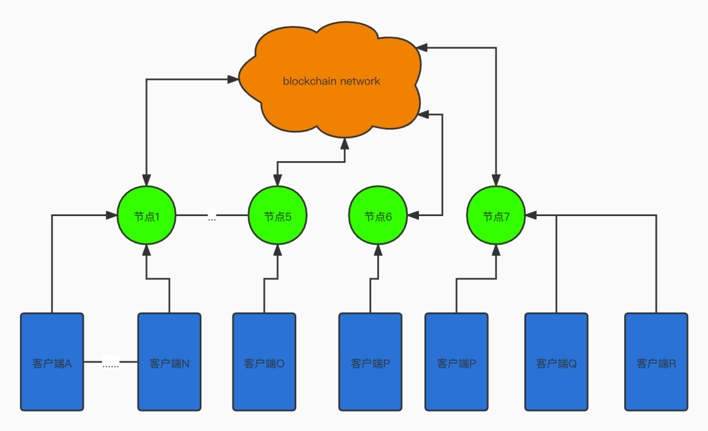
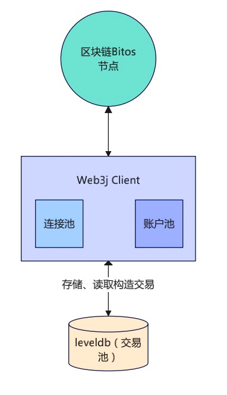

# BitOS 性能测试

### 1.依赖
- web3j 4.8.9
- maven
- springboot
- java1.8.0_301

### 2.项目描述

该项目为Bitos集群的测试项目，主要对集群进行性能测试，压力测试。

测试发送的交易为ERC20转账交易，在程序中内置了一个简单的ERC20的转账合约。每个java服务为一个客户端。

当需要多个客户端同时对多个节点发起交易时，可以选择以容器的方式部署多个客户端，每个客户端连接一个节点。




### 3.连接池、账户池、交易池、本地Nonce管理器



每个客户端在项目初始化的过程中，会初始化连接池和账户池。顾名思义，是用来储存测试连接和测试账户的池子。

每个客户端维护当前集群的所有状态和所有账户，集群的节点连接url存放在`application.yaml`中，
```yaml
    nodesUrl:
      - http://47.100.71.227:8545
      - http://47.100.71.227:8555
      - http://47.100.71.227:8565
      - http://47.100.71.227:8575
      - http://47.100.71.227:8585
      - http://47.100.71.227:8595
      - http://47.100.71.227:8605
```

所有的账户和keystore文件存放在`src/main/java/com/pool/AccountStr`中。

交易池主要用来存放所有尚未发送的提前构造好的批量交易。交易池以leveldb的方式存储。通过提前构造好，并写入数据库中，可以降低客户端签名对实际性能测试指标准确度的影响。

本地Nonce管理器主要是客户端用来维持本地的nonce，避免热点账户频繁请求nonce带来的网络开销，对整体性能测试带来的影响。

本地Nonce管理器需要考虑以下的问题：
- 发送交易过程中交易失败，对nonce的整体影响。

### 4.客户端和合约

每个客户端可以向任意一个节点以任意一个账户部署合约。

从逻辑清晰的角度上，每个客户端只保持一个智能合约的实例，记录一个智能合约的地址。

以七个客户端，七个节点为例，在性能测试准备过程中，会部署七个智能合约。

### 5.核心接口

##### 5.1 部署合约：
```shell
curl -X GET --header 'Accept: text/plain' 'http://172.17.0.1:12000/bitos/deploy_contract?peerId=0&accountId=0'
```

使用账户0向节点0上请求部署合约


##### 5.2 转账交易
```shell
curl -X GET --header 'Accept: text/plain' 'http://172.17.0.1:12000/BaseErc20TxController/transferValue?peerId=0&accountId=0'
```
使用账户0向节点0上请求发送转账ERC20转账交易，目的地址`0xb3d49259b486d04505b0b652ade74849c0b703c4`


##### 5.3 查询Sender交易
```shell

http://172.17.0.1:12000/BaseErc20TxController/querySenderBalance?accountId=0
```

查询账户在当前客户端部署的智能合约的ERC20余额，由于频率小，默认全部从peer0查询

##### 5.4 查询receiver交易

```shell
http://172.17.0.1:12000/BaseErc20TxController/queryReceiverBalance
```
查询receiver在当前客户端部署的智能合约的ERC20余额

##### 5.5 批量发送数据

- 5.5.1 批量构造数据
```shell
curl -X GET --header 'Accept: */*' 'http://172.17.0.1:12000/PerfTestController/pre_construct_data?peerId=0&accountId=0&txsNumber=10000'
```

- 5.5.2 发送交易
```shell
curl -X GET --header 'Accept: */*' 'http://172.17.0.1:12000/PerfTestController/send_txs?peerId=0&accountIndex=0&txsNumber=10000&interval=200'
```

### 6. 结果统计方式

```shell

curl -X GET --header 'Accept: text/plain' 'http://172.17.0.1:12000/PerfTestController/statisic_result'

```

##### 6.1 计算策略

##### 6.2 调用接口


### 7. 数据清理
客户端通过容器的方式进行启动，因此不需要做特殊的清理数据的工作。

当每次重启容器时，之前容器中的持久化数据已经被释放。

### 8. 测试中发现的问题

- mempool is full
- invalid nonce; got 1862, expected 1435: invalid sequence